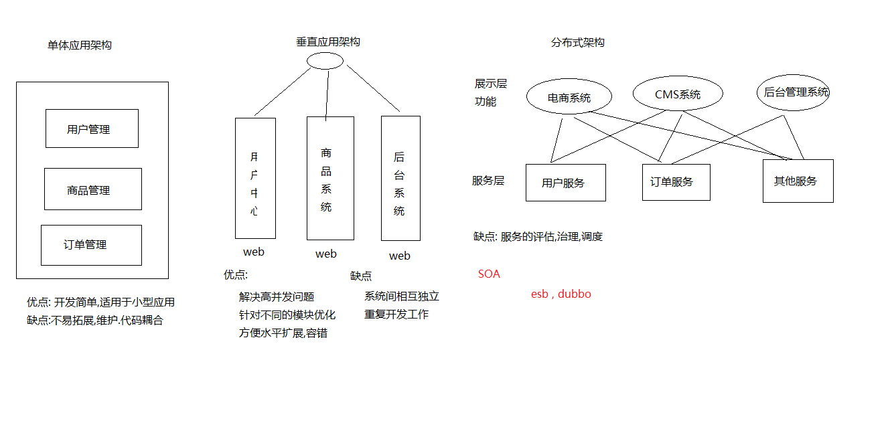
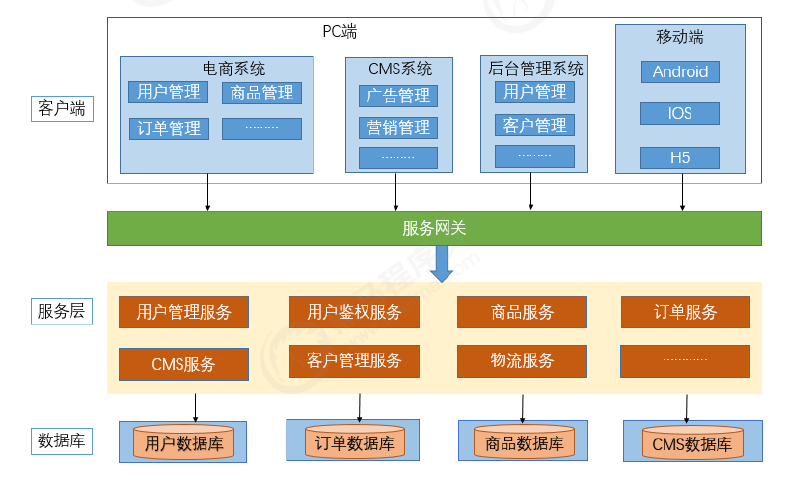
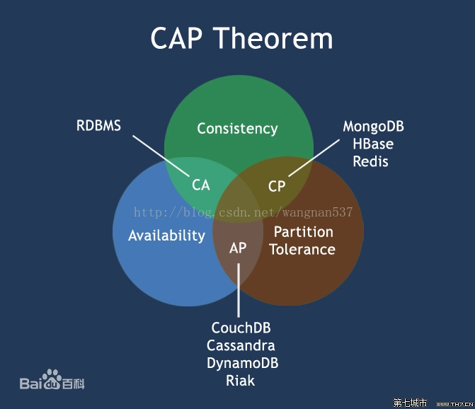

# 参考资料

```
百度网盘链接
https://pan.baidu.com/s/1Uog6mRwUvTrKngYHdKOJbg
提取码 je3f
```

练习代码: https://github.com/peckwood/blackhorse_spring_cloud_in_4_day

# 微服务的基础知识

## 系统架构的演变



### 单体应用架构

这种将所有功能都部署在一个web容器中运行的系统就叫做单体架构。

#### 优点：

- 所有的功能集成在一个项目工程中
- 项目架构简单，前期开发成本低，周期短，是小型项目的首选。

#### 缺点：

- 全部功能集成在一个工程中，对于大型项目不易开发、扩展及维护。
- 系统性能扩展只能通过扩展集群结点，成本高、有瓶颈。
- 技术栈受限。

### 垂直应用架构

当访问量逐渐增大，单一增加机器带来的加速度变得越来越小. 我们将应用拆成互不相干的几个应用，以提升效率

#### 优点：

- 解决高并发问题
- 通过垂直拆分，原来的单体项目不至于无限扩大
- 不同的项目可采用不同的技术
- 可以针对不同的模块优化

#### 缺点：

- 系统间相互独立
- 重复开发工作

### 分布式SOA架构

SOA , 即面向服务的架构。它可以根据需求通过网络对松散耦合的粗粒度应用组件(服务)进行分布式部署、组合和使用。

#### 优点

- 抽取公共的功能为服务, 提高开发效率
- 对不同的服务进行集群化部署解决系统压力
- 减少系统耦合

#### 缺点

- 抽取服务的粒度较大
- 服务提供方与调用方接口耦合度较高

### 微服务架构



#### 优点

- 通过服务的原子化拆分，以及微服务的独立打包、部署和升级，小团队的交付周期将缩短，运维成
  本也将大幅度下降
- 微服务遵循单一原则。微服务之间采用Restful等轻量协议传输。

#### 缺点

- 微服务过多，服务治理成本高，不利于系统维护。
- 分布式系统开发的技术成本高

### SOA与微服务的关系

微服务与SOA类似, 微服务是在SOA上做的升华. 微服务强调的是`业务需要彻底的原子化和服务化`, 它对服务的拆分更细.

| 功能     | SOA                  | 微服务                       |
| -------- | -------------------- | ---------------------------- |
| 组件大小 | 大块业务逻辑         | 单独任务或小块业务逻辑       |
| 耦合     | 通常松耦合           | 总是松耦合                   |
| 公司架构 | 任何类型             | 小型、专注于功能交叉团队     |
| 管理     | 着重中央管理         | 着重分散管理                 |
| 目标     | 确保应用能够交互操作 | 执行新功能, 快速扩展开发团队 |

## 分布式核心知识

### 分布式中的远程调用

目前主流的远程调用技术有基于HTTP的RESTful接口以及基于TCP的RPC协议。

#### Restful接口

HTTP协议里面，四个表示操作方式的动词：
GET、POST、PUT、DELETE。它们分别对应四种基本操作：GET用来获取资源，POST用来新建资源
（也可以用于更新资源），PUT用来更新资源，DELETE用来删除资源。

通过这些方式来实现对服务器资源的状态转化. 

#### RPC

RPC是一种进程间通信方式. 允许像调用本地服务一样调用远程服务器.

#### 区别与联系

|          | Restful    | RPC     |
| -------- | ---------- | ------- |
| 通讯协议 | HTTP       | TCP     |
| 性能     | 略低       | 较高    |
| 灵活度   | 高         | 低      |
| 应用     | 微服务架构 | SOA架构 |

### 分布式中的CAP原理

#### 分布式系统的三个特性

Consistency（一致性）：数据一致更新，所有数据的变化都是同步的
Availability（可用性）：在集群中一部分节点故障后，集群整体是否还能正确响应客户端的读写请求
Partition tolerance（分区容忍性）：因为网络是不稳定的, 这就要求有分区容错性, 不能因为数据中心之间的网络问题, 就破坏了用户的使用体验.


不能同时满足CAP.


| 选择 | 说明                                                         | 例子               |
| ---- | ------------------------------------------------------------ | ------------------ |
| CA   | 放弃分区容忍性，加强一致性和可用性 | 传统项目           |
| CP   | 放弃可用性，追求一致性和分区容忍性 | 电商系统, 社交网站 |
| AP   | 放弃一致性（这里说的一致性是强一致性），追求分区容忍性和可用性 | 支付系统           |

# Spring Cloud概述

## 微服务中的相关概念

### 服务的注册与发现

#### 服务注册

服务实例将自身服务信息注册到注册中心, 这些信息包括服务所在主机IP和端口, 以及自身服务状态以及访问协议等

#### 服务发现

服务实例请求注册中心获取所依赖服务信息。服务实例通过注册中心，获取到注册到其中的
服务实例的信息，通过这些信息去请求它们提供的服务


### 负载均衡

负载均衡是高可用网络基础架构的关键组件，通常用于将工作负载分布到多个服务器来提高网站、应
用、数据库或其他服务的性能和可靠性。


### 熔断

熔断这一概念来源于电子工程中的断路器（Circuit Breaker）。在互联网系统中，当下游服务因访问压
力过大而响应变慢或失败，上游服务为了保护系统整体的可用性，可以暂时切断对下游服务的调用。这
种牺牲局部，保全整体的措施就叫做熔断。


### 链路追踪

随着微服务架构的流行，服务按照不同的维度进行拆分，一次请求往往需要涉及到多个服务。互联网应
用构建在不同的软件模块集上，这些软件模块有可能布在了几千台服务器，横跨多个不同的数据中心。因此，就需要对一次请求涉及的多个服务链路进行日志记录，性能监控即链路追踪

### API 网关

随着微服务的不断增多，不同的微服务一般会有不同的网络地址，而外部客户端可能需要调用多个服务
的接口才能完成一个业务需求，如果让客户端直接与各个微服务通信可能出现：

- 客户端需要调用不同的url地址，增加难度
- 在一定的场景下，存在跨域请求的问题
- 每个微服务都需要进行单独的身份认证

针对这些问题，API网关顺势而生。

API网关字面意思是将所有API调用统一接入到API网关层，由网关层统一接入和输出。一个网关的基本
功能有：统一接入、安全防护、协议适配、流量管控、长短链接支持、容错能力。有了网关之后，各个
API服务提供团队可以专注于自己的的业务逻辑处理，而API网关更专注于安全、流量、路由等问题。


## SpringCloud的介绍

Spring Cloud是一系列框架的有序集合。它利用Spring Boot的开发便利性巧妙地简化了分布式系统基础设施的开发，如服务发现注册、配置中心、消息总线、负载均衡、断路器、数据监控等，都可以用Spring Boot的开发风格做到一键启动和部署。Spring Cloud并**没有重复制造轮子**，它只是将目前各家公司开发的比较成熟、经得起实际考验的服务框架组合起来，通过Spring Boot风格进行再封装屏蔽掉了复杂的配置和实现原理，最终给开发者留出了一套<u>简单易懂、易部署和易维护</u>的分布式系统开发工具
包。

### SpringCloud中的核心组件

Spring Cloud的本质是在 Spring Boot 的基础上，增加了一堆微服务相关的规范，并对应用上下文（Application Context）进行了功能增强。既然 Spring Cloud 是规范，那么就需要去实现，目前Spring Cloud 规范已有 Spring官方，Spring Cloud Netflix，Spring Cloud Alibaba等实现。通过组件化的方式，Spring Cloud将这些实现整合到一起构成全家桶式的微服务技术栈。

#### SpringCloud Netflix组件

| 组件名称 | 作用           |
| -------- | -------------- |
| Eureka   | 服务注册中心   |
| Ribbon   | 客户端负载均衡 |
| Feign    | 声明式服务调用 |
| Hystrix  | 客户端容错保护 |
| Zuul     | API服务网关    |

SpringCloud Alibaba组件

| 组件名称 | 作用           |
| -------- | -------------- |
| Nacos    | 服务注册中心   |
| Sentinel | 客户端容错保护 |

SpringCloud原生及其他组件

| 组件名称      | 作用           |
| ------------- | -------------- |
| Consul        | 服务注册中心   |
| Config        | 分布式配置中心 |
| Gateway       | API网关        |
| Sleuth/Zipkin | 分布式链路追踪 |

#### SpringCloud的体系结构


从上图可以看出Spring Cloud各个组件相互配合，合作支持了一套完整的微服务架构。

- **注册中心**负责服务的注册与发现，很好将各服务连接起来
- **断路器**负责监控服务之间的调用情况，连续多次失败进行熔断保护。
- **API网关**负责转发所有对外的请求和服务
- **配置中心**提供了统一的配置信息管理服务,可以实时的通知各个服务获取最新的配置信息
- **链路追踪**技术可以将所有的请求数据记录下来，方便我们进行后续分析
- 各个组件又提供了功能完善的dashboard监控平台,可以方便的监控各组件的运行状况

> [腾讯课程: 4天从浅入深精通SpringCloud 微服务架构](https://ke.qq.com/course/4846026#term_id=105016940)
>
> [视频: CAP原理: 取舍的艺术](https://www.bilibili.com/video/BV1Th41187yc/?vd_source=7bab9457d163bcbdfe38964322282906)

# 案例搭建

## 数据库表

## 搭建环境

## 搭建商品微服务

## 其他微服务

## 服务调用

### RestTemplate介绍

# 服务注册Eureka基础


